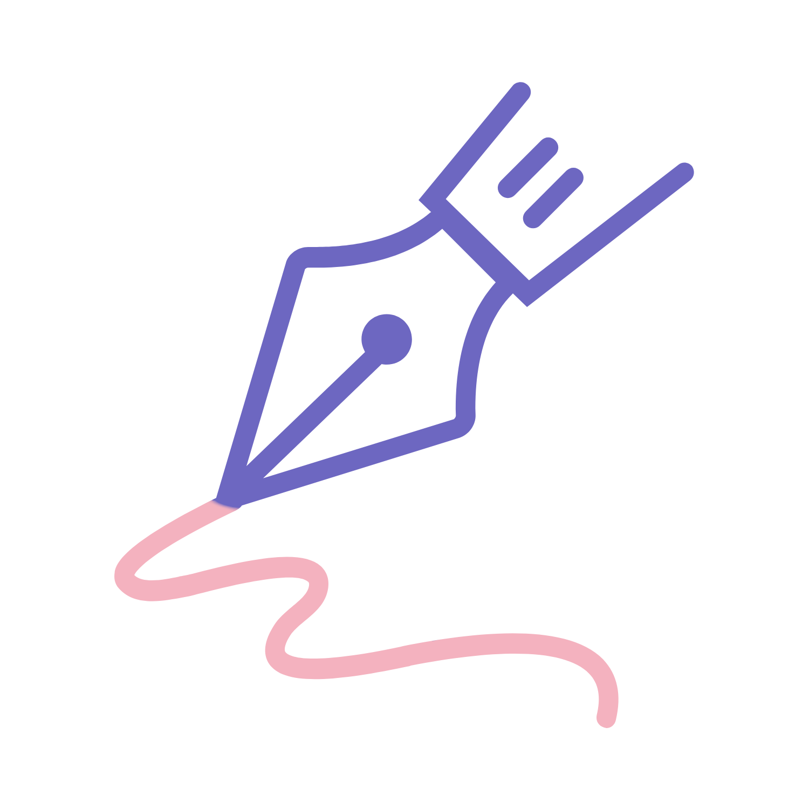

<div align="center">
  
</div>
<div align="center">
<h1> Wryte: Where Words Matter
</h1>

  <a href="https://github.com/bmariscotes-strat/bmariscotes-mini-project-2/releases">
    
  <a href="https://wryte-blog.vercel.app">
    
  </a>
</div>

#### ˚ʚ♡ɞ˚ ‎ [View Live Site](https://wryte-blog.vercel.app)

Wryte is a vibrant blogging platform where writers can express themselves freely and build meaningful connections with like-minded individuals. Created as a safe space for creative expression, Wryte fosters a community where diverse voices, shared values, and common interests come together.
<br>

## 🌟 Features

- **User Authentication**: Secure registration and account management system
- **Blog Creation**: Intuitive blog posting interface with rich text editing
- **Social Engagement**: Share posts and react with likes and other interactions
- **Easy Sharing**: Share posts with others via direct links
- **Public Access**: Non-authenticated users can still read and discover blog posts
- **Interactive Comments**: Engage with posts through thoughtful commenting
- **Threaded Replies**: Reply to comments and create meaningful discussions
- **Personal Dashboard**: View and manage your own blog posts
- **Community Feed**: Discover content from fellow writers
- **Clean Design**: Modern, responsive interface optimized for reading and writing

<br>

## ⚙️ Tech Stack

| Category               | Tools / Libraries                                                                                            |
| :--------------------- | :----------------------------------------------------------------------------------------------------------- |
| Frontend               | [Next.js](https://nextjs.org/), [React](https://reactjs.org/), [TypeScript](https://www.typescriptlang.org/) |
| Backend                | [Drizzle ORM](https://orm.drizzle.team/), [Neon Postgres](https://https://neon.com/)                         |
| Styling                | [Tailwind CSS](https://tailwindcss.com/), [Lucide Icons](https://lucide.dev/)                                |
| UI Component           | [TipTap React](https://tiptap.dev/docs/editor/getting-started/install/react)                                 |
| Media Service          | [Cloudinary](https://cloudinary.com/)                                                                        |
| Authentication Service | [Clerk](https://clerk.com/nextjs-authentication)                                                             |
| Version Managment      | [Semantic Versioning](https://semver.org/)                                                                   |
| Fonts                  | Google Fonts via `next/font`                                                                                 |
| Hosting                | [Vercel](https://vercel.com/)                                                                                |

<br>

## 🗂️ Project Structure

```
wryte-blog/
├── src/                   # Source directory
│   ├── app/               # Next.js app directory
│   │   ├── api/           # API routes
│   │   │   ├── posts/     # Posts API endpoints
│   │   │   └── webhooks/  # Webhook handlers
│   │   ├── blogs/         # Blog-related pages
│   │   │   ├── [slug]/    # Individual blog post pages
│   │   │   │   ├── edit/  # Edit blog post
│   │   │   │   └── page.tsx
│   │   │   └── my-blogs/  # User's blog management
│   │   ├── sign-in/       # Authentication pages
│   │   ├── sign-up/       # Registration pages
│   │   ├── loading.tsx    # Loading UI
│   │   ├── layout.tsx     # Root layout
│   │   ├── page.tsx       # Home page
│   │   └── globals.css    # Global styles
│   ├── components/        # Reusable components
│   │   ├── auth/          # Authentication components
│   │   ├── layout/        # Layout components
│   │   ├── ui/            # UI components
│   │   └── widgets/       # Widget components
│   ├── database/          # Database configuration
│   │   └── migrations/    # Database migrations
│   ├── hooks/             # Custom React hooks
│   ├── interface/         # TypeScript interfaces
│   ├── lib/               # Utility functions
│   ├── providers/         # Context providers
│   ├── styles/            # Styling files
│   └── middleware.ts      # Next.js Clerk middleware
├── public/                # Static assets
├── .env.local             # Environment variables
├── .gitignore            # Git ignore rules
├── drizzle.config.ts     # Database configuration
├── next.config.js        # Next.js configuration
├── package.json          # Project dependencies
├── postcss.config.mjs    # PostCSS configuration
├── tailwind.config.js    # Tailwind CSS configuration
└── tsconfig.json         # TypeScript configuration
```

<br>

## 📬 Contact

Want to collaborate or have feedback? Reach out via:

- 📧 [bm.mariscotes@gmail.com](mailto:your-email@gmail.com)
- 🌐 [LinkedIn](https://linkedin.com/in/biellamariscotes)
- 💻 [GitHub](https://github.com/biellamariscotes)

---

_© 2025 Biella Mariscotes. All rights reserved._

<hr>
